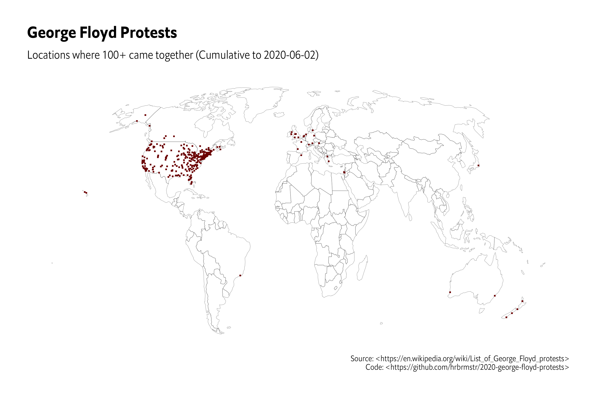

Code to collect data from various sources on the 2020 George Floyd protests.

## 2020-06-03

- No external PRs or issues
- Migrate to Git LFS for big files
- A few new URLs to cover prev days info
- Data sync from all current sourfes

## 2020-06-02

- No external PRs or issues
- Wikipedia page no longer has time-series table, but the extracted map data files are timestamped in the file name (yeah, yeah, I shld know better).
- Wikipedia page is updating national guard use in the locales; not sure how well yet.
- Added links of news coverage of 2020-06-01 protests.
- Added [Count Love](https://countlove.org) daily JSON data grabber. You will need to filter this data to use it for the George Floyd protests. Added issue about this.

## 2020-06-01 

- initial setup
- a [wikipedia entry](https://en.wikipedia.org/wiki/List_of_George_Floyd_protests) scraper.
- a [twitter thread puller](https://twitter.com/greg_doucette/status/1267297607782731777) that's been documenting brutality incidents
- `data/links-to-preserve.txt` which `nikisweeting/archivebox` (docker) is run daily on so PR into that file or file an issue so I can.
